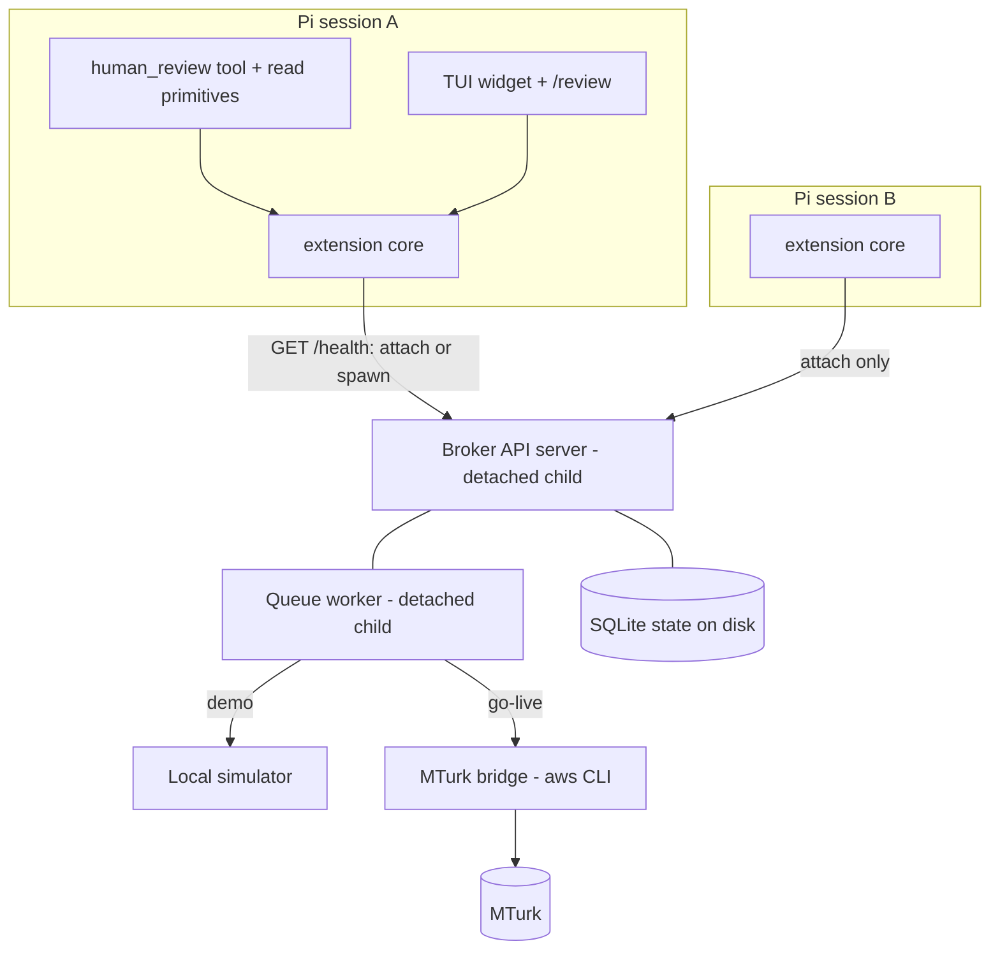
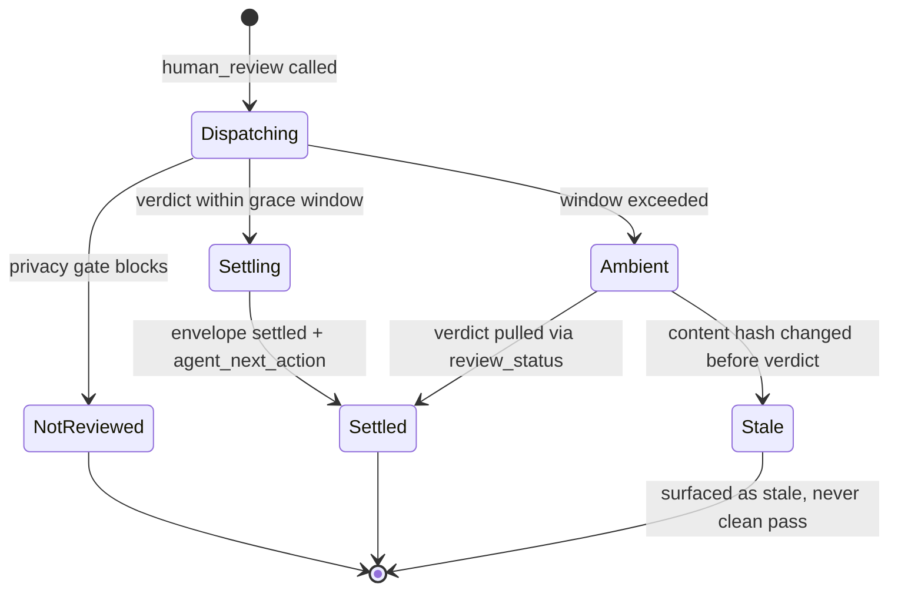

# Pi Human Review Extension - Plan

## Goal Capsule

- **Objective:** Ship a Pi (pi-mono) extension, living in this repo, that packages Vouch's human review as one `human_review` tool plus two read primitives — extension-managed per-machine broker, demo-first onboarding, ambient TUI verdict experience.
- **Product authority:** This plan owns only the packaging piece of the agent-native verification stack. Provisional verdicts, the verdict precedent cache, and non-Pi bindings are not active scope (see How This Work Fits Together).
- **Authority hierarchy:** Product Contract R-IDs govern behavior; KTDs govern mechanism within their cited Rs; units override neither.
- **Stop conditions:** Stop and surface if the Pi extension API cannot register tools, widgets, or session hooks as documented (Assumption ASM1 fails); if broker spawn cannot be made collision-safe; or if any change to `src/domain/` contracts becomes necessary (out of scope).
- **Execution profile:** New package in a repo with no workspace tooling; mirror root conventions (ESM NodeNext, strict TS, vitest, eslint type-checked). Demo path must stay offline-verifiable per repo posture ("prove offline, self-report live").
- **Open blockers:** None.

---

## Product Contract

Product Contract preservation: restructured and extended with user confirmation at plan-time — R2, R3, R5, R8, R12 amended; R14–R19 added; KD2 amended; KD7–KD8 added. Reason: planning research found R3 cited a non-existent contract value (`pending` is not an `AgentNextAction`), per-session broker ownership broke R7 under concurrent sessions, and the agent-native review surfaced guardrail gaps (simulated-verdict containment, privacy-block signaling, idempotency, spend). All changes confirmed in the scoping synthesis.

Document-review corrections (2026-08-12, 11 reviewers incl. 4 independence-verified cross-model): mechanism-level refinements to R7 (reboot bound), R9 (off-path widget states), R18 (no broker collection endpoint) and KTDs 3/5/7/8 plus new KTD9 (broker auth + loopback bind) — these correct technical claims the reviewers proved wrong against the codebase and preserve product scope. Deferred as genuine product decisions, not silently applied: a proactive-invocation requirement, an internal-pool-first go-live split, per-call stakes/tier on the tool, and CI-job isolation — see the handoff summary.

### Summary

A Pi extension exposes one `human_review` tool that runs Vouch's five-call review choreography internally, discovers or spawns a per-machine local broker, and delivers verdicts adaptively: demo-mode verdicts return inside the tool call with a rewarding reveal; real reviews return an ambient handle, tracked by a TUI widget, with verdicts re-entering through read primitives and next-session surfacing. First run reaches a first verdict in under 60 seconds with zero configuration.

### Problem Frame

Vouch has the hard parts built — a typed one-call client, a structured feedback contract, consensus, privacy gating, an append-only ledger — but no agent surface exposes them: the MCP broker maps ten tools 1:1 to HTTP endpoints, so an integrating agent must learn a five-call choreography, run its own broker, and poll by hand. External research found no product combining cheap crowd-consensus verification with an agent-native tool interface. The gap is packaging, not machinery.

### Key Decisions

- KD1. **Pi (pi-mono) is the first surface** (session-settled: user-directed — chosen over Claude Code/generic MCP packaging: the user's own daily agent harness; dogfooding is the demand evidence). Governs R1, R4.
- KD2. **The extension manages a per-machine broker: discover-or-spawn, ref-counted** (session-settled: user-directed extension-managed broker, amended user-approved at plan-time from per-session "owns" to per-machine shared — two concurrent Pi sessions would collide on one port and one SQLite file, and a per-session owner breaks R7). Governs R5, R6, R7, R19.
- KD3. **Demo-first with a guided go-live switch** (session-settled: user-directed — chosen over MTurk-sandbox default and self-review default: instant free first win; real reviewers behind one deliberate step). Governs R11, R12, R13, R14.
- KD4. **Adaptive tool with an explicit result envelope** (session-settled: user-directed adaptive tool; envelope form user-approved at plan-time — `pending` is not an `AgentNextAction` value, so the ambient arm is a typed envelope variant, not a sixth action). Governs R2, R3, R9, R18.
- KD5. **UX bar: don't make them think, slightly rewarding** (session-settled: user-directed standing directive; widget and reveal design delegated to implementation). Governs R9, R10.
- KD6. **Extension code lives in this repo** (session-settled: user-directed — chosen over pi-mono and a separate package: the extension versions with the broker it spawns; one repo to plan and CI against).
- KD7. **Verdicts are pull-based; no unprompted injection into a live agent loop** (user-approved — a late verdict queues for the agent's next read-primitive call and notifies the operator; interrupting mid-task is not v1 behavior). Governs R8, R18.
- KD8. **Agent-visible guardrails are product behavior, not implementation detail** (user-approved — demo containment, privacy-block signaling, duplicate-spend protection, and a cumulative spend ceiling were added as requirements after the agent-native review). Governs R14, R15, R16, R17.

### Actors

- A1. **Operator** — the human running Pi; configures nothing on day one, flips go-live, consumes verdicts.
- A2. **Agent** — the Pi agent loop; calls `human_review` and the read primitives, branches on the result envelope.
- A3. **Reviewers** — simulated (demo) or real crowd via the existing MTurk bridge (go-live).
- A4. **Broker** — the Vouch Fastify API + queue worker + SQLite state, discovered or spawned by the extension.

### Requirements

**Tool surface**

- R1. The extension registers a `human_review` tool that accepts criteria and artifacts and internally performs the full job → artifacts → privacy → task → feedback choreography; the agent never sees individual endpoints.
- R2. The tool waits up to a grace window for a verdict; demo-mode verdicts settle inside the window by construction, and reviews that cannot settle in-window return an ambient handle immediately. Real-crowd reviews are expected to always take the ambient path.
- R3. The tool returns a discriminated result envelope: `settled` (carrying the existing `agent_next_action` value and feedback), `ambient` (carrying a review handle), or `not_reviewed` (per R15). The envelope extends the existing client result shape; no new `AgentNextAction` value is introduced.
- R4. A `/vouch-review` operator command triggers the same path manually for the current work product. The Vouch namespace avoids collisions with commands registered by other Pi harnesses.
- R18. The extension registers two read primitives: `review_status(handle)` and `list_pending_reviews()`. A fresh agent in a new session can find and act on any verdict through them; late verdicts queue for pull per KD7. The broker exposes no collection endpoint (every GET is keyed by a known `jobId`), so the extension's own on-disk handle registry (KTD7, shared across sessions) is the authoritative enumeration source — `list_pending_reviews()` iterates registry entries and polls `/verification-jobs/:jobId/feedback` per handle.
- R19. Multiple concurrent reviews are supported — across one session and across concurrent Pi sessions sharing the one per-machine broker — with each handle resolving independently.

**Broker lifecycle**

- R5. On first use the extension discovers a running broker (health check on the extension's configured port) and attaches, or spawns one (API server + queue worker) with zero configuration; no credentials, ports, or config files are required before the first verdict.
- R6. A configuration setting points the extension at an external broker instead; when set, the extension never spawns.
- R7. In-flight reviews survive Pi session close **while the machine stays up**: broker state persists on disk, the broker process outlives any single session, and a closed session never orphans a dispatched (including paid) review. Detached children do not survive a reboot; at `session_start` the extension respawns the broker pair (and bridge, when live) if any review is in flight, and surfaces any review whose deadline elapsed while unsupervised as expired rather than pending (R8).
- R8. On session start, the extension surfaces verdicts that arrived since the last session before new work begins. Each surfaced verdict reports whether the reviewed content hash still matches the workspace; a mismatch is presented as stale, not as a clean pass.

**Review experience**

- R9. While a review is ambient, a TUI widget shows live state: dispatched → responses arriving (with count) → quorum reached → verdict. It also surfaces the off-happy-path states the plan already commits to elsewhere — stuck/slow (from `stuckState`, KTD4), bridge-down (U6), spend-blocked (R17), and stale (AE8) — so a stalled or blocked review is never invisible (KD5).
- R10. Verdict arrival is a deliberately designed, lightly rewarding moment; design specifics are delegated per KD5.
- R11. Demo mode is always visibly labeled as simulated reviewers; a demo verdict is never presentable to the operator as a real one.
- R12. Go-live to real reviewers is a single guided ceremony — credentials, spend confirmation, and startup of the MTurk bridge process (which requires a working `aws` CLI) — and is the only step allowed to require operator thought. After it, real reviews dispatch without further setup.

**Agent guardrails**

- R14. Every result envelope and surfaced verdict carries an explicit `simulated: true|false` field; an agent can always distinguish a demo verdict from a real one without parsing provider identifiers.
- R15. A privacy-gate block is returned as `not_reviewed` with the blocking reasons as the primary signal — never as a reviewer `fail`. An agent must be able to tell "policy blocked this from review" from "humans reviewed and rejected this."
- R16. The idempotency key is derived from the criteria set and artifact content hashes, so re-calling `human_review` for unchanged work re-attaches to the existing job instead of creating a duplicate (paid) dispatch.
- R17. Cumulative real-money spend is tracked against a configurable ceiling; when a dispatch would breach it, the dispatch is blocked until the operator re-confirms. One go-live approval never authorizes unlimited agent-initiated spend.

**Onboarding**

- R13. Fresh install → first verdict completes in under 60 seconds with zero config edits, using demo mode.

### Key Flows

- F1. **First run (demo)**
  - **Trigger:** Operator installs the extension; agent (or `/vouch-review`) requests a review.
  - **Steps:** Extension spawns broker pair → dispatches to the local simulator → verdict settles inside the grace window → rewarding reveal, visibly labeled demo, `simulated: true` in the envelope.
  - **Covers:** R1, R2, R5, R11, R13, R14.
- F2. **Real review across sessions**
  - **Trigger:** Go-live complete; agent requests a review; crowd latency exceeds the grace window.
  - **Steps:** Tool returns an `ambient` envelope → widget tracks live state → operator closes Pi → broker keeps running, state persists → verdict lands via the MTurk bridge → next session surfaces the verdict (with staleness check) → agent pulls it via `list_pending_reviews` / `review_status` and branches on `agent_next_action`.
  - **Covers:** R2, R3, R7, R8, R9, R12, R18.
- F3. **Go-live**
  - **Trigger:** Operator opts out of demo mode.
  - **Steps:** Guided ceremony collects credentials and spend ceiling, confirms spend, starts the MTurk bridge → subsequent reviews dispatch to real reviewers → demo labeling disappears; envelopes carry `simulated: false`.
  - **Covers:** R11, R12, R17.

### Acceptance Examples

- AE1. **Covers R5, R13.** Given a fresh install and no config, when the operator triggers a review, then a demo verdict arrives in under 60 seconds without any credential, port, or file edit.
- AE2. **Covers R7, R8, R18.** Given a live MTurk review in flight, when the operator quits Pi and reopens it two hours later, then the arrived verdict is surfaced at session start and a fresh agent can retrieve it with `list_pending_reviews` → `review_status`; no review was lost.
- AE3. **Covers R2, R3.** Given crowd latency beyond the grace window, when `human_review` is called, then the tool returns an `ambient` envelope immediately and the later verdict re-enters as a `settled` result via the read primitives.
- AE4. **Covers R11, R12.** Given demo mode, when a verdict is shown, then it is visibly labeled simulated; and go-live is the only flow that asks the operator for credentials or spend.
- AE5. **Covers R14.** Given a demo verdict, when the agent reads the envelope, then `simulated: true` is present and an agent release gate can refuse to treat it as verification.
- AE6. **Covers R15.** Given an artifact the privacy gate blocks from external review, when `human_review` returns, then the envelope is `not_reviewed` with the blocking reasons — the agent does not enter a repair loop over work no human saw.
- AE7. **Covers R16.** Given the same artifacts and criteria submitted twice, when the second call runs, then exactly one job and one dispatch (one charge) exist and the second call re-attaches.
- AE8. **Covers R8.** Given a verdict arriving after the reviewed content changed, when it is surfaced, then it is presented as stale rather than as a clean pass.
- AE9. **Covers R17.** Given cumulative spend at the ceiling, when the agent requests another real review, then dispatch is blocked until the operator re-confirms.
- AE10. **Covers R19.** Given two in-flight reviews (including from two concurrent Pi sessions), when verdicts arrive, then each resolves to its own handle and neither session's close orphans the other's review.

### Success Criteria

- Still enabled after two weeks of dogfooding, with agent-produced UI changes no longer shipping unverified (habit).
- Fresh install → first verdict under 60 seconds, zero config edits (onboarding; also R13).
- At least 20 verdicts on real work within two weeks, median time-to-verdict inside a working session (throughput).
- At least one verdict changed what shipped — a fail or retry acted on (trust).

### Scope Boundaries

**Deferred for later**

- Provisional verdicts with expiry and a reversal event — verdicts are immutable once finalized and no reversal event exists in the contract.
- Verdict precedent cache (content-hash verdict reuse). R16's idempotency re-attach is job-level dedupe, not verdict reuse.
- Generic MCP packaging and OpenAI/LangChain/AutoGen bindings.
- Webhook/push from broker to agent — the ambient path stays pull-based (documented no-webhook design); the read primitives are the sanctioned channel.
- Cancel/abandon flows for dispatched reviews (either direction) beyond existing HIT expiry.
- Multi-machine or shared-team broker — single machine, single user.
- Unprompted verdict injection into a live agent loop (KD7 chooses pull).
- Heavier gamification (leaderboards, points economies).

**Outside this plan**

- Changes to consensus, adjudication, privacy, or provider internals under `src/domain/`; the extension consumes existing behavior. Adding a sixth `AgentNextAction` value is such a change and is explicitly avoided by KD4.

<!-- ce-section: work-relationships -->
### How This Work Fits Together

This plan owns the packaging piece of the agent-native verification stack from [docs/ideation/2026-08-12-vouch-expansion-ideation.html](../ideation/2026-08-12-vouch-expansion-ideation.html) (idea 1). The breakdown below is the current understanding, not a committed roadmap.

- **Verdict precedent cache** — enables cheap repeat verification; can proceed independently; shares the `contentHash` and source-context fields already persisted.
- **Provisional settlement + reversal event** — depends on this plan (the tool surface makes latency pressure real); still to decide: reversal semantics for already-acted-on verdicts.
- **Generic MCP / other-framework bindings** — depends on lessons from the Pi surface; shares the one-call abstraction and the result envelope defined here.

### Outstanding Questions

**Deferred to implementation** (non-blocking)

- Q8. What `/vouch-review`'s "current work product" resolves to when no agent supplied criteria/artifacts — recommended default: the uncommitted git diff, with the operator confirming a criteria set; resolve at U5 start, and define the no-diff case. (Design-lens, whole-doc.)

- Q2. Exact grace-window length for demo/fast pools, and the short in-window `pollIntervalMs` the settle path passes to `requestHumanReview()` (client default is 15s; the demo worker resolves in ~1s) so the reveal feels instant inside the 60s budget.
- Q3. Widget, reveal, and light-gamification design (KD5 delegation); keep "streak" within the "slightly rewarding" bar, not a persisted gamification mechanic. Pi's overlay API is experimental — fall back to a non-overlay widget if unstable.
- Q5. Whether `/vouch-review` auto-suggests at natural moments in v1.
- Q7. Verify the MTurk bridge assignment clamp (`MTURK_MAX_ASSIGNMENTS` default 1, `MTURK_MAX_ASSIGNMENTS_PER_HIT` default 3) against the high-risk preset (5) before go-live promises high-tier reviews.

---

## Planning Contract

### Key Technical Decisions

- KTD1. **Target the `@earendil-works/*` Pi packages, declared as peerDependencies.** The `@mariozechner/*` scope is deprecated (renamed ~May 2026); docs live at pi.dev. Extension ships as an npm-shaped package with a `pi.extensions` entry in its manifest, loaded by Pi via jiti (no compile step); installable with `pi install` and testable with `pi -e`.
- KTD2. **Tool execution model: blocking `execute()` for the settle path; early return for ambient.** Pi tool calls are strictly request/response — a tool cannot deliver its result after returning. Demo/fast reviews run inside `execute()` with `onUpdate` progress, `ctx.ui` widget updates, and abort via the provided `signal`. Reviews that exceed the grace window return the `ambient` envelope (R3); re-entry is via the read primitives, `session_start` replay, and `ctx.ui.notify` (per KD7). Schema uses TypeBox with `StringEnum` (plain `Type.Union`/`Type.Literal` breaks Google-provider schemas).
- KTD3. **Broker process model: detached children, discover-before-spawn, three processes once live.** The broker is `buildApp()` + `server.listen()` (src/api/server.ts) plus the queue worker (src/workers/index.ts) — two supervised children spawned detached so they outlive the Pi session (R7); once go-live is configured the MTurk bridge is a **third** detached child (port 3100), since MTurk results reach the broker only through the bridge's poll loop and AE2's cross-session survival depends on it. Launch contract: `npm run build:js` is a prerequisite (there is no `dist/` after the default `tsc --noEmit`); the extension resolves the repo root from its own module URL and spawns `node <repo>/dist/api/server.js`, `node <repo>/dist/workers/index.js`, and the bridge; v1 supports `pi install ./extensions/pi` from a checkout, not a standalone npm install (KTD6, U7). Discovery: authenticated + version-checked health probe (KTD9) on each process's extension-owned default port (not 3000); a proven match means attach, never double-spawn. The in-process `buildApp()`+`inject()` pattern (scripts/lib/broker-transport.ts) is tests-only — it cannot satisfy R7. Cites KD2, KTD9. Lifecycle: spawn lazily on first use (never at extension factory time, per Pi's extension rules); at `session_start` respawn any absent child (broker pair, and bridge when live) if a review is in flight; `session_shutdown` detaches without killing while reviews are in flight.
- KTD4. **Reuse `requestHumanReview()`; extend its result into the envelope.** The extension calls `scripts/lib/agent-review-client.ts` (five-call choreography, pricing defaults, `AgentFeedback`) rather than reimplementing it, injecting `fetchImpl` where useful. The R3 envelope extends the existing `HumanReviewRequestResult` shape (`jobId`, `reviewTaskId`, `feedback?`, `stuckState?`, `timedOut`) — `stuckState` surfaces through `review_status` as the "why is this slow" answer. Cites R3, R18.
- KTD5. **Demo mode is the broker's default; go-live is a gated broker restart, not a live env flip.** `LOCAL_PROVIDER_MODE` defaults to `simulated` and the client defaults `reviewerPool` to `managed`, which routes to the simulator. The extension must simply not set `LOCAL_PROVIDER_MODE=disabled` and not pass `reviewerPool: "internal"`. Provider config is read once inside `buildApp()` (`src/api/app.ts:270`), so go-live cannot mutate a running broker's mode: the ceremony writes the new provider env, blocks while any handle is in `ambient` state on the shared broker (or requires explicit operator confirmation), SIGTERMs the API child (which checkpoints WAL on SIGTERM), respawns the pair with the new env, and starts the bridge (port 3100, `aws` CLI via `execFile`, callback URL) — then re-verifies via the health probe before declaring go-live complete. Because KD2 shares the broker, go-live can be deferred by another session's in-flight review (state this in R12's operator-facing surface). Cites KD3, KTD3.
- KTD6. **Package location: `extensions/pi/` folded into root tooling — no workspace tooling introduced** (session-settled: user-directed in-repo location per KD6; the fold-in mechanism is this KTD's choice over adding npm/pnpm workspaces to a repo with zero workspace precedent). Root `tsconfig.json` include, eslint type-checked globs, and vitest cover the new directory; a `validate:pi-extension` script joins the existing `validate:*` offline harness convention in CI. Node ≥ 24 per repo engines.
- KTD7. **Idempotency via an extension-side handle registry, not broker `createOrGet` alone.** The extension persists an `idempotencyKey → {jobId, reviewTaskId, handle}` record in its per-user data dir; on a key hit it returns the existing handle (re-polling feedback) **without calling `requestHumanReview()` at all**. Broker-side `createOrGet` (`src/domain/jobs/job-service.ts:40-46`) dedupes only the job row — the client then unconditionally POSTs `/human-review-tasks` (`scripts/lib/agent-review-client.ts`), which creates and dispatches a second paid task with no idempotency check, so the extension registry is the only place the duplicate charge (AE7) is actually stopped. Key = stable hash of (criteria IDs + statements, artifact content hashes, template id, reviewer pool, simulated-vs-real mode) so a demo-then-real re-review does not collide; a `force_new: true` tool parameter appends a nonce for a deliberate second opinion (R17's ceiling still applies).
- KTD8. **Spend ceiling: extension re-confirm UX over broker-enforced accounting.** The dispatch decision is made inside the broker route (`src/api/routes/human-review.ts`), which every client passes through — the extension ledger alone cannot see the existing `scripts/request-review.ts` CLI path or a second concurrent session (KD2 shares one broker). Enforce the cumulative ceiling in the broker's SQLite state and reject dispatch there at the limit; the extension owns only the operator re-confirm surface (R17). Meter the bridge's post-clamp `reward * maxAssignments` per first dispatch (a missing cost value is a hard block, not a zero increment; re-attached calls per KTD7 contribute nothing). Sandbox-by-default (`MTURK_ALLOW_PRODUCTION=false`) remains the backstop.
- KTD9. **The spawned broker is authenticated and loopback-bound.** The supervisor generates a random `RUNTIME_OPERATOR_TOKEN` on first spawn, persists it 0600 in the per-user data dir, passes it to both children, and sends it on every broker call — this both closes the unauthenticated-dispatch surface (any local/LAN process could otherwise POST paid HITs or forge `simulated:false` verdicts) and makes `stuckState`/`/runtime/inspection` reachable with zero operator configuration (R5 preserved). Both children (and the bridge) bind `127.0.0.1`, never the repo default `0.0.0.0` (`src/api/server.ts:32`), honoring the single-machine scope boundary. Discovery attaches only after the health responder proves knowledge of the stored token **and** matches a broker `version` field, converting trust-on-first-use and post-upgrade skew into named errors. Governs R5, R6, R7 (security posture); cited by KTD3, U2.

### High-Level Technical Design

Component topology — one broker pair per machine, shared by sessions:

Review lifecycle and envelope states:

Directional guidance, not implementation specification: exact module boundaries inside the extension may shift during implementation.

### Assumptions

- ASM1. Pi's `ExtensionAPI` supports `registerTool`, `registerCommand`, `ctx.ui.setWidget`/`setStatus`/`notify`, and `session_start`/`session_shutdown` events as documented at pi.dev — verified against extension docs during planning; the TUI component detail (`tui.md`) and exact current semver were not fully verified and must be checked at implementation start (ASM1 residual runs as a spike before U3, per U7).
- ASM2. Spawned detached children plus SQLite WAL (with a busy timeout, U2) give adequate crash-safety for a single-user machine; no supervisor daemon is added.
- ASM3. The MTurk bridge remains operator-run via the go-live ceremony; the extension manages its lifecycle but does not reimplement it.

### Risks & Dependencies

- **Pi API churn.** The package scope was renamed (`@mariozechner/*` → `@earendil-works/*`, ~May 2026) and the overlay UI API is marked experimental. Mitigation: peerDependencies with `"*"` range (KTD1); U7 re-verifies current semver and Node engine floor before any pin; U5 carries the non-overlay fallback (Q3). Stale-scope content across the web is a trap — cite pi.dev only.
- **Detached-process fragility.** No supervisor daemon exists (ASM2); a broker crash mid-review leaves children unmanaged. Mitigation: all review state is on-disk SQLite (WAL), so recovery is discover-before-spawn on next use (KTD3); the U7 harness asserts no orphan processes; U2 tests cover crash-then-reattach.
- **SQLite writer contention.** WAL permits concurrent readers but not concurrent writers; two broker processes on one DB file is the corruption path, and even the intended single-broker design runs the API and worker as two writers with `BEGIN IMMEDIATE` and no `busy_timeout` in the repo today — a lock collision raises `SQLITE_BUSY` as a hard tool failure. Mitigation: authenticated health-check-then-attach makes spawning conditional (KTD3/KTD9); the supervisor sets a busy timeout before relying on the two-process design (U2); the external-broker setting (R6) bypasses spawning entirely.
- **Unauthenticated broker surface.** An auto-spawned, always-on broker with no auth and the repo's `0.0.0.0` default bind would let any local or LAN process dispatch paid HITs or forge `simulated:false` verdicts. Mitigation: loopback bind + generated operator token + token-proving discovery (KTD9).
- **Machine-reboot durability bound.** Detached children die on reboot; a paid review's 24h default deadline can expire before the next Pi session respawns the poller. Mitigation: R7's session-start respawn-and-reconcile; deadlines re-checked and expired reviews surfaced as expired.
- **MTurk clamp conflict.** The bridge caps assignments via `MTURK_MAX_ASSIGNMENTS` (default 1) and `MTURK_MAX_ASSIGNMENTS_PER_HIT` (default 3), while the high-risk pricing preset dispatches 5. Q7 resolves the interaction inside U6 before high-tier dispatch is offered.
- **Agent-initiated spend.** An agent retry loop spends real money on one historical approval. Mitigation: R17 ceiling with operator re-confirm (KTD8); sandbox-by-default remains the backstop.
- **Repo tooling fold-in.** Type-aware lint fails for files outside the root `tsconfig.json` include. Mitigation: U7 wires include/globs and gates via `./script/cibuild` before merge.

---

## Implementation Units

### U1. Result envelope and review client wrapper

- **Goal:** A typed, tested envelope module the tool and primitives share.
- **Requirements:** R3, R14, R15, R16 (KD4, KD8; KTD4, KTD7).
- **Dependencies:** None.
- **Files:** `extensions/pi/src/envelope.ts`, `extensions/pi/src/review-client.ts`, `extensions/pi/src/classify-artifact.ts`, `extensions/pi/test/envelope.test.ts`.
- **Approach:**
  1. Define the discriminated envelope (`settled` | `ambient` | `not_reviewed`) extending `HumanReviewRequestResult` per KTD4.
  2. Map broker outcomes into it. Privacy blocks arrive two ways, both → `not_reviewed` with the block reason as the primary signal (R15): the finalized `fail_closed` + `policy_constraints` path, **and** a 403 from `POST /verification-jobs/:jobId/human-review-tasks` (dispatch-time `assertProviderDispatchAllowed`) — the 403 must be mapped here, distinct from U1's generic broker-error path, or it surfaces as a transport failure. Simulator provenance (`providerId: "local-provider-simulator"`) → `simulated: true` (R14).
  3. Own the idempotency registry per KTD7: check it before calling the client; on a hit re-poll the existing handle and issue no new dispatch.
  4. `classify-artifact.ts` maps the tool's optional `data_class` argument (default `internal_low`) onto `RequestHumanReviewOptions.dataClass` so the privacy-block path (AE6) is actually reachable — the client otherwise hardcodes `redaction_status: "completed"` / `externalization_decision: "allowed"`.
- **Patterns to follow:** `scripts/lib/agent-review-client.ts` types; ESM NodeNext with explicit `.js` import extensions; strict TS; plain `Error` with descriptive messages.
- **Test scenarios:**
  - Happy path: settled pass feedback maps to `settled` with `agent_next_action: "pass"` and `simulated` set from provider identity.
  - Covers AE5. A simulator-provenance outcome maps to `simulated: true`, distinct from a real-provider outcome mapping to `simulated: false`.
  - Covers AE6. Privacy-blocked job maps to `not_reviewed` carrying policy reasons; never `settled`/`fail`.
  - Covers AE7. Same criteria + artifact hashes produce the same idempotency key; the second call re-attaches and issues zero POSTs to `/human-review-tasks`; changed hash produces a new key.
  - Covers AE6. A dispatch-time 403 from `/human-review-tasks` maps to `not_reviewed` carrying the block reason, not a transport error.
  - Edge: feedback with `stuckState` and `timedOut` maps to `ambient` with stuck info attached.
  - Error: broker HTTP failure (non-403) surfaces as a typed error, not a malformed envelope.
- **Verification:** Unit tests pass; envelope type consumed by U3 without casts.

### U2. Broker supervisor

- **Goal:** Discover-or-spawn lifecycle for the per-machine broker pair.
- **Requirements:** R5, R6, R7, R19 (KD2; KTD3, KTD5, KTD9).
- **Dependencies:** None.
- **Files:** `extensions/pi/src/broker-supervisor.ts`, `extensions/pi/test/broker-supervisor.test.ts`.
- **Approach:**
  1. Create the per-user data dir at mode `0700`; resolve config: extension-owned default port, DB/artifact paths inside that dir, optional external broker URL (R6). Generate and persist (0600) the operator token per KTD9. Set a SQLite busy timeout on the spawned broker (WAL permits concurrent readers but not concurrent writers, and no `busy_timeout` exists in the repo today — two long-lived writers otherwise raise `SQLITE_BUSY`).
  2. Authenticated + version-checked health probe first (KTD9); on a proven match attach. On failure spawn detached API server + queue worker children, bound to `127.0.0.1`, with the operator token and env per KTD5, then poll health until ready.
  3. Never kill children holding in-flight reviews at `session_shutdown`; detach instead.
- **Execution note:** Start with a failing integration test that spawns against a temp data dir and asserts health, single-instance reuse, and survival after the parent exits.
- **Test scenarios:**
  - Happy path: no broker running → spawn → healthy → demo review resolvable end-to-end.
  - Covers AE10. Second supervisor instance attaches to the running broker; no second spawn, no port error.
  - Edge: configured external broker URL → never spawns even when unhealthy; reports status instead.
  - Failure: port occupied by a non-Vouch process, or a Vouch broker of a mismatched version, or a health responder that cannot prove the operator token → clear named error, no attach, no spawn loop.
  - Security: the spawned broker is not reachable on a non-loopback interface; a request without the operator token is rejected.
  - Concurrency: concurrent API-write + worker-claim against the shared DB does not raise `SQLITE_BUSY`.
  - Integration: parent process exits; children persist; a new supervisor attaches and finds prior state.
- **Verification:** Integration test proves spawn/attach/survive; no zombie processes after tests.

### U3. `human_review` tool and read primitives

- **Goal:** The agent-facing surface: one workflow tool, two read primitives, registered with Pi.
- **Requirements:** R1, R2, R3, R18, R19 (KD4, KD7; KTD1, KTD2).
- **Dependencies:** U1, U2.
- **Files:** `extensions/pi/src/index.ts`, `extensions/pi/src/tools.ts`, `extensions/pi/test/tools.test.ts`.
- **Approach:**
  1. Register `human_review` with a TypeBox schema (StringEnum per KTD2); `execute()` runs U1's client, updates progress via `onUpdate`, honors the abort `signal`, settles in-window or returns the `ambient` envelope.
  2. Register `review_status(handle)` and `list_pending_reviews()` reading broker state via U2's connection; surface `stuckState` in `review_status`.
  3. Enforce lazy broker startup on first tool use, not at factory time.
- **Test scenarios:**
  - Covers AE1/F1. Demo call settles in-window and returns `settled` + `simulated: true`.
  - Covers AE3. Wait exceeding the grace window returns `ambient` with a usable handle; `review_status(handle)` later returns `settled`.
  - Covers AE2 (agent half). With no in-memory state, `list_pending_reviews()` finds an arrived verdict.
  - Edge: abort signal mid-wait cancels cleanly; review stays dispatched (no orphan).
  - Error: broker unreachable → typed tool error (`isError`), not a hang.
- **Verification:** Tool trio registers under `pi -e ./extensions/pi` smoke; scenarios pass against a real spawned broker in the harness.

### U4. Session lifecycle and ambient tracking

- **Goal:** Verdicts survive and re-enter across sessions; staleness is visible.
- **Requirements:** R7, R8 (KD7; KTD3).
- **Dependencies:** U2, U3.
- **Files:** `extensions/pi/src/session.ts`, `extensions/pi/test/session.test.ts`.
- **Approach:**
  1. On `session_start`, reconcile from the extension's handle registry (KTD7 — the broker has no collection endpoint): poll `/feedback` per registered handle for verdicts postdating the last-seen marker; notify via `ctx.ui.notify` and queue for pull (KD7). Respawn the broker pair (and bridge, when live) if any registry handle is in flight and its process is absent (post-reboot, R7); mark any review whose deadline elapsed while unsupervised as expired, not pending.
  2. Record the reviewed content hash + workspace ref with each handle; compare at surface time and mark stale on mismatch (R8). Note the content hash derives from the rendered task template, not source files — the mismatch comparison re-renders the criteria against current workspace state.
  3. On `session_shutdown`, persist tracking state (append-only, fsynced); detach broker per U2.
- **Test scenarios:**
  - Covers AE2. Verdict arrives while no session runs → next `session_start` surfaces it once (not repeatedly).
  - Covers AE8. Content hash mismatch at surface time → marked stale.
  - Edge: multiple pending verdicts surface in arrival order; already-surfaced verdicts are not re-notified.
  - Edge: aborted-mid-wait review (U3) with a registry handle is tracked and surfaces normally next session.
  - Integration: registry corruption → surface a named recovery error and keep the append-only write intact; never silently crash the session (broker-derivation rebuild is impossible — no collection endpoint).
- **Verification:** Simulated close/reopen cycle in tests; manual `pi` smoke shows next-session notification.

### U5. TUI widget, verdict reveal, and `/vouch-review` command

- **Goal:** The operator-facing experience: ambient live state, rewarding reveal, manual trigger.
- **Requirements:** R4, R9, R10, R11 (KD5; KTD1, KTD2).
- **Dependencies:** U3, U4.
- **Files:** `extensions/pi/src/ui.ts`, `extensions/pi/test/ui.test.ts`.
- **Approach:**
  1. Ambient widget via `ctx.ui.setWidget` (aboveEditor): dispatched → votes arriving (count) → quorum reached → verdict, plus the off-path states from R9 (stuck/slow, bridge-down, spend-blocked, stale); spinner via `setWorkingIndicator` while waiting.
  2. Verdict reveal: agreement summary + streak (session-local, not a persisted gamification mechanic — Q3); prefer the overlay API, fall back to non-overlay widget if the experimental overlay is unstable (Q3).
  3. Persistent demo-mode banner in every review surface (R11).
  4. `/vouch-review` command dispatches the same path as the tool, resolving its input per Q8.
- **Execution note:** Mostly presentation; prefer `pi -e` runtime smoke plus snapshot-style component tests over deep unit coverage.
- **Test scenarios:**
  - Happy path: widget transitions through the states as broker state changes, including the stuck and spend-blocked states.
  - Covers AE4. Demo verdicts render the simulated label; post-go-live verdicts do not.
  - Edge: two concurrent reviews render as two entries without clobbering (R19).
- **Verification:** Manual `pi -e` walkthrough of F1; widget states match broker state in the harness.

### U6. Go-live ceremony and spend controls

- **Goal:** The one deliberate step: credentials, spend ceiling, gated broker restart, bridge lifecycle.
- **Requirements:** R12, R17, R14 (KD3, KD8; KTD5, KTD8, KTD9).
- **Dependencies:** U1 (envelope + spend-block case), U2 (supervisor + restart), U3.
- **Files:** `extensions/pi/src/go-live.ts`, `extensions/pi/test/go-live.test.ts`.
- **Approach:**
  1. Guided flow: check `aws` CLI presence, collect MTurk credentials, set the spend ceiling, confirm spend. Write credentials to a single `0600` file in the `0700` data dir (or OS keychain) — never as process arguments, never echoed in the ceremony transcript, re-read at each broker/bridge respawn; the matched two-sided env contract includes `MTURK_BRIDGE_API_KEY` and `PROVIDER_SHARED_SECRET`. Cite `docs/security/provider-secret-handling.md` as the governing posture.
  2. Perform the gated broker restart per KTD5 (block while any `ambient` review exists or require confirmation), then start and supervise the bridge (port 3100, `127.0.0.1`, callback URL) as the third detached child (KTD3).
  3. Spend accounting is broker-enforced (KTD8): the broker rejects dispatch at the ceiling; the extension owns the re-confirm surface. A spend-ceiling block returns `not_reviewed` with a spend reason (mirroring R15's privacy-block shape), not a hang.
  4. Sandbox stays the default; production requires the explicit existing `MTURK_ALLOW_PRODUCTION` opt-in.
  5. Resolve Q7 here: verify the bridge's `MTURK_MAX_ASSIGNMENTS` / `MTURK_MAX_ASSIGNMENTS_PER_HIT` clamp against the high-tier preset (5) before enabling high-risk dispatches.
- **Test scenarios:**
  - Covers AE9. Spend at ceiling → dispatch blocked → `not_reviewed` spend envelope → re-confirm unblocks.
  - Re-attached call (KTD7) does not increment cumulative spend.
  - Go-live requested with an in-flight `ambient` review → ceremony blocks or defers, does not kill the review.
  - Happy path: ceremony completes → gated restart → subsequent envelope carries `simulated: false`.
  - Error: missing `aws` CLI → ceremony stops with a named remedy, nothing half-configured; no credential value reaches logs or the widget.
  - Edge: bridge process dies → next real dispatch surfaces a bridge-down error; a later `session_start` respawns it if a review is in flight.
- **Verification:** Sandbox-mode end-to-end dispatch in the harness (or documented manual run); ceiling logic unit-tested.

### U7. Packaging, CI harness, and docs

- **Goal:** The extension builds, lints, tests, and validates like the rest of the repo, and a newcomer can install it.
- **Requirements:** R13 (KD6; KTD1, KTD6). Also carries ASM1's residual verification.
- **Dependencies:** U1–U6.
- **Files:** `extensions/pi/package.json`, root `tsconfig.json`, `package.json` (scripts), `scripts/validate-pi-extension.ts`, `extensions/pi/README.md`, `.github/workflows/ci.yml`.
- **Approach:**
  1. **ASM1 residual runs first, as a zero-dependency spike before U3** (moved out of U7's tail): pin `@earendil-works/*` semver and confirm `registerTool` / `registerCommand` / `ctx.ui.*` / `session_start` / `session_shutdown` against a throwaway `pi -e` extension. The Stop Condition (ASM1 fails) then costs one probe, not six units of rework.
  2. Nested `extensions/pi/package.json` declares `@earendil-works/*` + TypeBox as peerDependencies for publish shape; add the same packages to the **root** `package.json` devDependencies so `npm ci` resolves them for root typecheck and typed lint (npm does not install a nested non-workspace package's deps, and peerDeps are never auto-installed — both `tsc --noEmit` and `eslint .` would otherwise fail TS2307 on day one).
  3. Fold `extensions/pi` into root tsconfig include, eslint globs, vitest config; keep type-aware lint resolving.
  4. `validate:pi-extension`: offline harness that runs `build:js` first (produces the `dist/` the supervisor spawns), spawns the broker pair, runs a demo review end-to-end, asserts the envelope and the under-60-second timing (AE1), and cleans up children (assert no orphans). Register in CI after the existing `validate:*` scripts.
  5. README: install (`pi install ./extensions/pi` from a checkout), demo, go-live, config, and artifact/verdict retention posture; link it from the root README.
- **Test scenarios:** Test expectation: none beyond the harness itself — this unit is packaging and wiring; the harness is its test.
- **Verification:** `./script/cibuild` green including the new harness; `pi install ./extensions/pi` from a clean checkout reaches AE1.

---

## Verification Contract

| Gate | Command | Proves |
|---|---|---|
| Typecheck | `npm run build` | New package compiles under root strict config |
| Lint | `npm run lint` | Type-aware lint resolves for `extensions/pi` |
| Unit/integration tests | `npx vitest run extensions/pi` | U1–U6 scenarios, including AE5, AE6, AE7, AE8, AE9, AE10 |
| Offline harness | `npm run validate:pi-extension` | F1 end-to-end: spawn → demo review → settled envelope in < 60s (AE1), no orphan processes |
| Pi runtime smoke | `pi -e ./extensions/pi` (manual) | Tool/command/widget register in a real Pi session; F2 walkthrough with a long-latency simulated review |
| Bridge survival | manual sandbox walkthrough | Dispatch a sandbox review, close Pi, reopen after the bridge poll interval → verdict surfaced (F2/R7 for the real path) |
| Full CI | `./script/cibuild` | Nothing else in the repo regressed |

The sandbox MTurk path (F3, AE-level for R12/R17) is verified manually at go-live; the harness never spends money.

---

## Definition of Done

- All Verification Contract gates pass; the new harness runs in CI.
- Every AE (AE1–AE10) is covered by a test, the harness, or a documented manual walkthrough (AE2/F2, F3 sandbox).
- A fresh checkout reaches a demo verdict via `pi install` + one tool call in under 60 seconds (R13).
- No dead-end or experimental code from abandoned approaches remains in the diff.
- `extensions/pi/README.md` documents install, demo, go-live, and config; root README links to it.
- Deferred items (Scope Boundaries) remain untouched — no partial provisional-verdict or cache code.

---

## Appendix

### Sources / Research

- [docs/ideation/2026-08-12-vouch-expansion-ideation.html](../ideation/2026-08-12-vouch-expansion-ideation.html) — ranked ideation this direction came from (idea 1; market prior art: Tendem/Toloka, HITL MCP servers, framework approval gates).
- Pi extension API — `https://raw.githubusercontent.com/badlogic/pi-mono/main/packages/coding-agent/docs/extensions.md` (registerTool/registerCommand/ctx.ui/session events; factory rules), `https://pi.dev` (current docs), npm `@earendil-works/pi-coding-agent` (current scope; `@mariozechner/*` deprecated). `pi-ask-user` (github.com/edlsh/pi-ask-user) — third-party prior art for human-input extension UX.
- `src/api/app.ts` (`buildApp` — builds but never listens), `src/api/server.ts` (listen + signal handlers), `scripts/lib/broker-transport.ts` (in-process test transport precedent).
- `src/config/runtime.ts` (PORT default 3000; `LOCAL_PROVIDER_MODE` default simulated; SQLite paths).
- `src/workers/index.ts`, `src/workers/provider-dispatch-worker.ts` (queue worker is a separate process; queued simulated dispatch resolves there).
- `scripts/lib/agent-review-client.ts` (`requestHumanReview`, `AgentFeedback`, `HumanReviewRequestResult`, randomUUID idempotency default, `fetchImpl` injection).
- `src/domain/feedback/agent-action.ts` (`AgentNextAction` has five values — no `pending`; drove KD4).
- `src/domain/privacy/privacy-gate.ts`, `src/domain/privacy/externalization-policy.ts` (fail-closed block → drove R15).
- `src/api/routes/stuck-state.ts` (`stuck_reason`, `recommended_next_action` — surfaced via `review_status`).
- `scripts/mturk-bridge.ts` (port 3100, `aws` CLI via execFile, poll intervals 15s→300s backoff, sandbox default, per-HIT caps; Q7 clamp check).
- `scripts/lib/review-templates.ts` (StructuredTaskTemplate; verify `text_quality_rubric` params branch at implementation).
